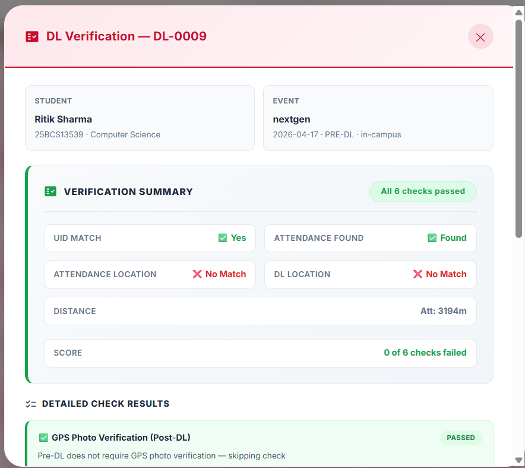
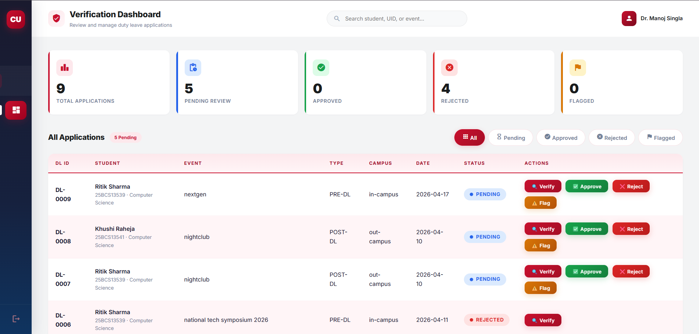
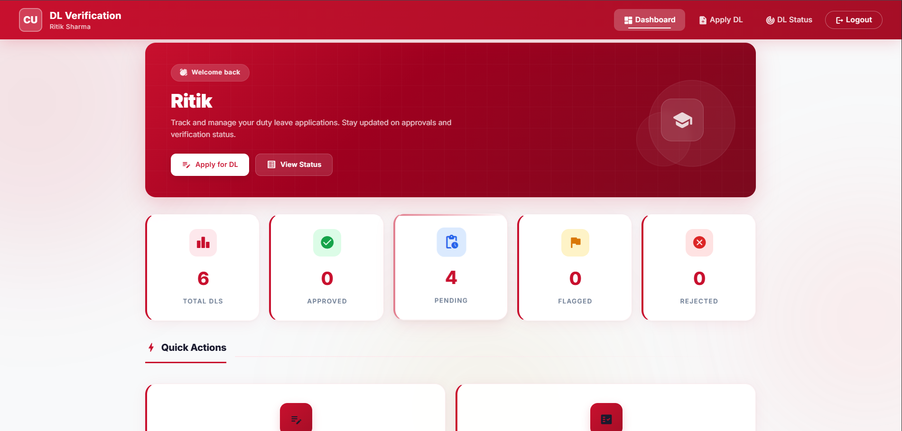

# 📌 QR-Based Attendance & Fake Duty Leave Detection System


---
## 🚀 Overview
This project is a smart attendance and duty leave verification system that uses QR codes, GPS location tracking, and MongoDB to prevent fake attendance and fraudulent duty leave claims.

---

## 🎯 Features
- 📱 QR-based attendance marking  
- 📍 GPS location verification  
- 🧾 Duty Leave (DL) application system  
- 🔍 Cross-verification using UID and location  
- 🧠 Score-based validation system  
- 🖥️ Admin panel for monitoring  

---

## 🛠️ Tech Stack

### Frontend:
- HTML  
- CSS  
- JavaScript  

### Backend:
- Node.js  
- Express.js  

### Database:
- MongoDB Atlas  

### Other Tools:
- QR Code Generator  
- Geolocation API  

---

## 📂 Project Structure

project/
│── frontend/  
│── backend/  
│── models/  
│── routes/  
│── controllers/  
│── .gitignore  
│── package.json  
│── README.md  

---

## 🔧 Installation

```bash
git clone https://github.com/your-username/your-repo.git
cd your-repo
npm install---

```

## ▶️ Run Project
```bash
npm start  
```
---

## 🔐 Environment Variables

- Create a `.env` file:

- MONGODB_URI=your_mongodb_connection_string
- PORT=5000  

---

## ⚙️ How It Works

1. Student scans QR code and marks attendance  
2. System captures GPS location and stores data in MongoDB  
3. Student applies for Duty Leave  
4. System verifies:
   - UID match  
   - Attendance record  
   - Location match  
5. Admin reviews verification details  

---

## 🎯 Key Benefits

- Prevents fake attendance  
- Eliminates proxy system  
- Automated verification  
- Improves transparency  

---
## 📸 Screenshots

### Verification Page


### Admin Dashboard


### DL Verification


---

## 🚧 Future Scope

- Mobile app integration  
- Face recognition  
- AI-based fraud detection  

---

## 👨‍💻 Author

-Riitk Sharma  

---
## ⚠️ Usage Restriction

This project is proprietary and cannot be used, copied, or modified without permission from the author.

---

## ⭐ Acknowledgment

This project was developed as part of academic learning to solve real-world problems using technology.
